Group\_Exercises
================
Dylan Nikol
8/18/2020

**Group Members: Samir Epili, Jake Johnson, Dylan Nikol, Luke Stevens**

# Visual story telling part 1: green buildings

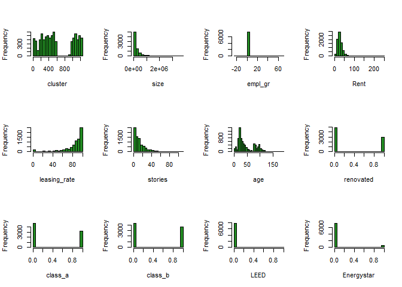<!-- -->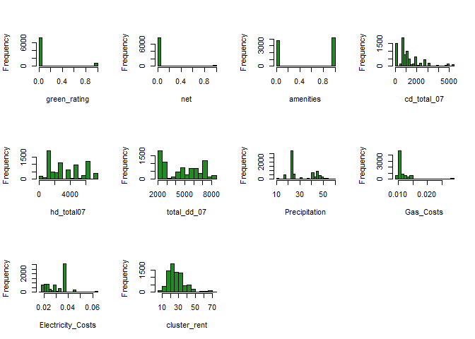<!-- -->

The distribution of age seems to be bimodal, with peaks around 30 and
90. Mean rent is around $25 per square foot, however the distribution is
skewed right and there seems to be a lot of outliers. The class A and
class B distributions indicate that the data consists of 3 classes of
buildings: A, B, C. There also seems to be very few green-rated
buildings. Overall, the buildings have a wide range of characteristics,
thus, generalizations from the entire dataset may not be useful in
making accurate predictions for your project. For this reason, we
decided to subset the data with features similar to your building.

### Subset 1: Renovated buildings and buildings under 20 years old

    ## [1] 27.49709

    ##    Min. 1st Qu.  Median    Mean 3rd Qu.    Max. 
    ##    2.98   19.43   24.50   27.50   33.00  250.00

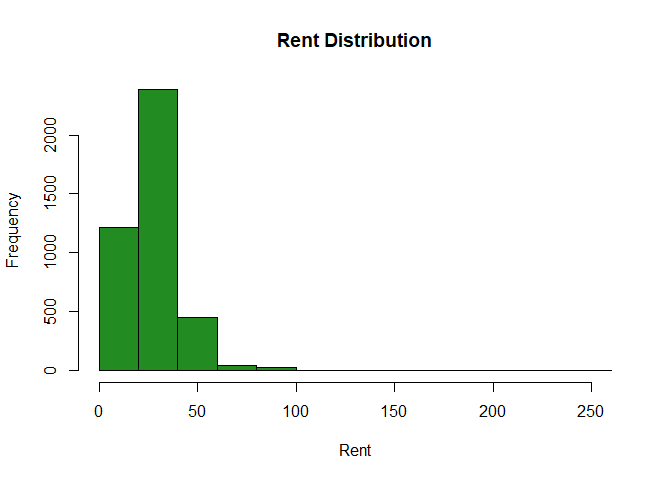<!-- -->
We only looked at buildings under 20 years old or those that have been
renovated. This gives us a more realistic comparison, by only
considering similar buildings to yours.

``` r
sub1_a = subset(subset_1, class_a==1)
sub1_not_a = subset(subset_1, class_a==0)

subset_level2 = subset(sub1_a, green_rating==1)
not_subset_level2 = subset(sub1_a, green_rating==0)
```

Here we further subset into buildings that are Class A, and not Class A
(our building will be Class A). We then split the buildings within Class
A based on if they are green or not.

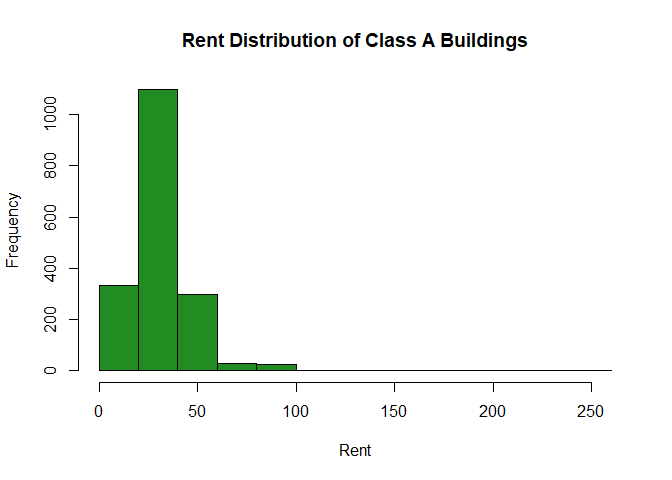<!-- -->

    ## [1] "Rent is concentrated around $20-$30 and has a lof of skew. "

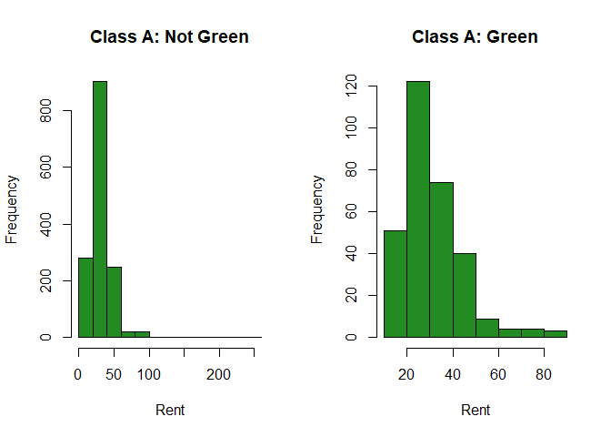<!-- -->

Bootstrapping for the median Rent of these buildings shows a very
non-normal distribution. Thus, the guru should not have used the median
to compare green and non-green buildings as there is a skew towards
lower rents, making it an ineffective way to compare green and non-green
buildings. The bootstrapped mean Rent, however, is very normally
distributed and was therefore used when comparing the Rents of green and
non-green buildings.

### Boostrapping

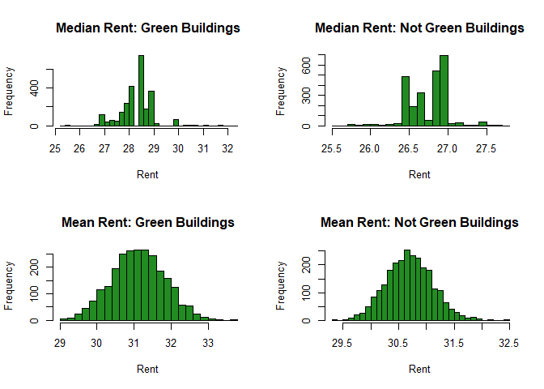<!-- -->

### Bootstrapping Summary Statistics

    ## Confidence Interval from Bootstrap Distribution (2500 replicates)

    ##                2.5%    97.5%
    ## percentile 29.69875 32.49683

    ## Confidence Interval from Bootstrap Distribution (2500 replicates)

    ##                2.5%    97.5%
    ## percentile 29.91687 31.52157

    ## [1] "Mean rent for Green Class A Buildings is: $ 31.11"

    ## [1] "Mean rent for Non-Green Class A Buildings is: $ 30.69"

    ## [1] "Rent premium for a Green building: $ 103987.5"

    ## [1] "Ratio of Guru's estimate to ours : 0.16"

    ## [1] "Payback period for green certification:  48.08"

    ## [1] "Payback period for green certification (75th percentile rent): 22.34"

Assuming the average rent premium of $0.42, for a green building,the
payback period for green certification is 48.08 years. If you can charge
the $0.90 premium (premium of the upper quartile of green buildings),
you can reduce the payback period for Green certification by more than
50%. It would now be only be 22.34 years.

### Discussion

All in all, we do not agree with the conclusions of your stats Guru. The
person had the right idea about only using at a subset of the data for
their analysis, but they misstep in two ways. First, they should not
have arbitrarily removed outlier buildings from their analysis. Instead,
they should have taken a more deliberate and methodical approach to
subsetting the data. Our method of isolating newer or renovated
buildings that fall in the same class as your building produces more
precise figures for estimation. Second, they used the wrong metric to
make predictions. The Guru made their estimations using the median rent,
however the mean rent is a more evenly distributed figure and allows for
more accurate predictions. You can see this from the histograms of the
median versus the mean rents.

At every level of subsetting we performed, we see that the mean rents of
green and non-green buildings are very similar. This indicates that
although people may like the idea of renting in a green building, it
doesn’t seem like they are willing to pay the premium required to cover
a green certification.

# Visual story telling part 2: flights at ABIA

# Visual story telling

One of the worst part of flying is all the extra time spent dealing with
delays. They can make you late for important deadlines and cause
unnecessary stress in an already stressful experience. We will analyze
this data set of flights to and from the Austin airport to provide
helpful insights on trends in delayed flights.

``` r
library(mosaic)
library(tidyverse)
```

    ## -- Attaching packages ------------------------------------------------------------------------------- tidyverse 1.3.0 --

    ## v tibble  3.0.1     v stringr 1.4.0
    ## v tidyr   1.1.0     v forcats 0.5.0
    ## v purrr   0.3.4

    ## -- Conflicts ---------------------------------------------------------------------------------- tidyverse_conflicts() --
    ## x mosaic::count()            masks dplyr::count()
    ## x purrr::cross()             masks mosaic::cross()
    ## x mosaic::do()               masks dplyr::do()
    ## x tidyr::expand()            masks Matrix::expand()
    ## x dplyr::filter()            masks stats::filter()
    ## x ggstance::geom_errorbarh() masks ggplot2::geom_errorbarh()
    ## x dplyr::lag()               masks stats::lag()
    ## x tidyr::pack()              masks Matrix::pack()
    ## x mosaic::stat()             masks ggplot2::stat()
    ## x mosaic::tally()            masks dplyr::tally()
    ## x tidyr::unpack()            masks Matrix::unpack()

``` r
library(ggplot2)
abia = read.csv("~/MSBAsummer20/STA380-master/data/ABIA.csv", stringsAsFactors=FALSE)
attach(abia)
depDelay_clean = abia[!is.na(abia$DepDelay), ]
arrDelay_clean = abia[!is.na(abia$ArrDelay), ]
summary(abia)
```

    ##       Year          Month         DayofMonth      DayOfWeek        DepTime    
    ##  Min.   :2008   Min.   : 1.00   Min.   : 1.00   Min.   :1.000   Min.   :   1  
    ##  1st Qu.:2008   1st Qu.: 3.00   1st Qu.: 8.00   1st Qu.:2.000   1st Qu.: 917  
    ##  Median :2008   Median : 6.00   Median :16.00   Median :4.000   Median :1329  
    ##  Mean   :2008   Mean   : 6.29   Mean   :15.73   Mean   :3.902   Mean   :1329  
    ##  3rd Qu.:2008   3rd Qu.: 9.00   3rd Qu.:23.00   3rd Qu.:6.000   3rd Qu.:1728  
    ##  Max.   :2008   Max.   :12.00   Max.   :31.00   Max.   :7.000   Max.   :2400  
    ##                                                                 NA's   :1413  
    ##    CRSDepTime      ArrTime       CRSArrTime   UniqueCarrier        FlightNum   
    ##  Min.   :  55   Min.   :   1   Min.   :   5   Length:99260       Min.   :   1  
    ##  1st Qu.: 915   1st Qu.:1107   1st Qu.:1115   Class :character   1st Qu.: 640  
    ##  Median :1320   Median :1531   Median :1535   Mode  :character   Median :1465  
    ##  Mean   :1320   Mean   :1487   Mean   :1505                      Mean   :1917  
    ##  3rd Qu.:1720   3rd Qu.:1903   3rd Qu.:1902                      3rd Qu.:2653  
    ##  Max.   :2346   Max.   :2400   Max.   :2400                      Max.   :9741  
    ##                 NA's   :1567                                                   
    ##    TailNum          ActualElapsedTime CRSElapsedTime     AirTime      
    ##  Length:99260       Min.   : 22.0     Min.   : 17.0   Min.   :  3.00  
    ##  Class :character   1st Qu.: 57.0     1st Qu.: 58.0   1st Qu.: 38.00  
    ##  Mode  :character   Median :125.0     Median :130.0   Median :105.00  
    ##                     Mean   :120.2     Mean   :122.1   Mean   : 99.81  
    ##                     3rd Qu.:164.0     3rd Qu.:165.0   3rd Qu.:142.00  
    ##                     Max.   :506.0     Max.   :320.0   Max.   :402.00  
    ##                     NA's   :1601      NA's   :11      NA's   :1601    
    ##     ArrDelay           DepDelay          Origin              Dest          
    ##  Min.   :-129.000   Min.   :-42.000   Length:99260       Length:99260      
    ##  1st Qu.:  -9.000   1st Qu.: -4.000   Class :character   Class :character  
    ##  Median :  -2.000   Median :  0.000   Mode  :character   Mode  :character  
    ##  Mean   :   7.065   Mean   :  9.171                                        
    ##  3rd Qu.:  10.000   3rd Qu.:  8.000                                        
    ##  Max.   : 948.000   Max.   :875.000                                        
    ##  NA's   :1601       NA's   :1413                                           
    ##     Distance        TaxiIn           TaxiOut         Cancelled      
    ##  Min.   :  66   Min.   :  0.000   Min.   :  1.00   Min.   :0.00000  
    ##  1st Qu.: 190   1st Qu.:  4.000   1st Qu.:  9.00   1st Qu.:0.00000  
    ##  Median : 775   Median :  5.000   Median : 12.00   Median :0.00000  
    ##  Mean   : 705   Mean   :  6.413   Mean   : 13.96   Mean   :0.01431  
    ##  3rd Qu.:1085   3rd Qu.:  7.000   3rd Qu.: 16.00   3rd Qu.:0.00000  
    ##  Max.   :1770   Max.   :143.000   Max.   :305.00   Max.   :1.00000  
    ##                 NA's   :1567      NA's   :1419                      
    ##  CancellationCode      Diverted         CarrierDelay     WeatherDelay   
    ##  Length:99260       Min.   :0.000000   Min.   :  0.00   Min.   :  0.00  
    ##  Class :character   1st Qu.:0.000000   1st Qu.:  0.00   1st Qu.:  0.00  
    ##  Mode  :character   Median :0.000000   Median :  0.00   Median :  0.00  
    ##                     Mean   :0.001824   Mean   : 15.39   Mean   :  2.24  
    ##                     3rd Qu.:0.000000   3rd Qu.: 16.00   3rd Qu.:  0.00  
    ##                     Max.   :1.000000   Max.   :875.00   Max.   :412.00  
    ##                                        NA's   :79513    NA's   :79513   
    ##     NASDelay      SecurityDelay    LateAircraftDelay
    ##  Min.   :  0.00   Min.   :  0.00   Min.   :  0.00   
    ##  1st Qu.:  0.00   1st Qu.:  0.00   1st Qu.:  0.00   
    ##  Median :  2.00   Median :  0.00   Median :  6.00   
    ##  Mean   : 12.47   Mean   :  0.07   Mean   : 22.97   
    ##  3rd Qu.: 16.00   3rd Qu.:  0.00   3rd Qu.: 30.00   
    ##  Max.   :367.00   Max.   :199.00   Max.   :458.00   
    ##  NA's   :79513    NA's   :79513    NA's   :79513

Which airline has the worst departure delays?

``` r
airline_delay = depDelay_clean %>%
  group_by(UniqueCarrier)  %>%
  summarize(avg_delay_mins = mean(DepDelay))
```

    ## `summarise()` ungrouping output (override with `.groups` argument)

``` r
ggplot(airline_delay, aes(x=reorder(UniqueCarrier, avg_delay_mins), y=avg_delay_mins)) + 
  geom_bar(stat='identity', color='forest green') +
  labs(title = "Average departure delay by airline", x="Unique Carrier", y="Delay(mins)")
```

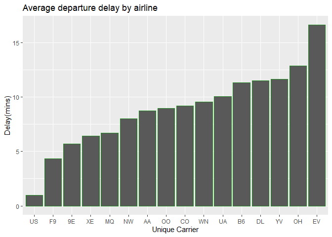<!-- -->

What about by arrival delays?

``` r
airline_arr_delay = arrDelay_clean %>%
  group_by(UniqueCarrier)  %>%
  summarize(avg_delay_mins = mean(ArrDelay))
```

    ## `summarise()` ungrouping output (override with `.groups` argument)

``` r
ggplot(airline_arr_delay, aes(x=reorder(UniqueCarrier, avg_delay_mins), y=avg_delay_mins)) + 
  geom_bar(stat='identity', color='forest green') +
  labs(title = "Average arrival delay by airline", x="Unique Carrier", y="Delay(mins)")
```

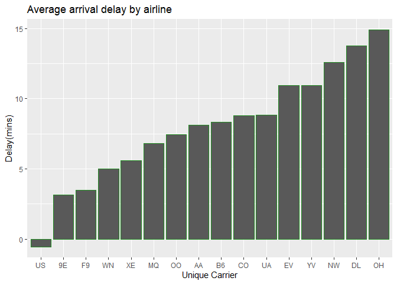<!-- -->

When should you leave? For this, we will examine the top four most
frequent airline fliers to see not only time trends but if different
airlines handle these differences in different ways.

Month

``` r
airline_list = c('AA', 'WN', 'CO', 'YV')

flights_per_month = depDelay_clean %>%
  filter(UniqueCarrier %in% airline_list) %>%
  group_by(UniqueCarrier, Month) %>%
  summarize(avg_delay_mins = mean(DepDelay))
```

    ## `summarise()` regrouping output by 'UniqueCarrier' (override with `.groups` argument)

``` r
ggplot(flights_per_month, aes(x=Month, y=avg_delay_mins)) + 
  geom_line( color='forest green') +
  geom_point( size=4, shape=21, fill="white") +
  facet_wrap(~ UniqueCarrier, nrow = 2) +
  theme_bw(base_size=18) +
  scale_x_continuous(breaks = 1:12) +
  labs(title = "Average departure delay by month", y="Delay (mins)")
```

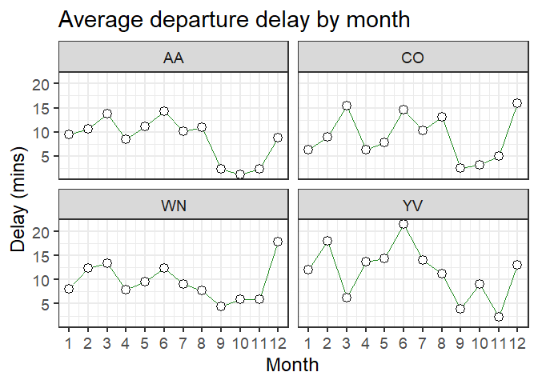<!-- -->

Day of Month

``` r
flights_day_month = depDelay_clean %>%
  filter(UniqueCarrier %in% airline_list) %>%
  group_by(UniqueCarrier, DayofMonth) %>%
  summarize(avg_delay_mins = mean(DepDelay))
```

    ## `summarise()` regrouping output by 'UniqueCarrier' (override with `.groups` argument)

``` r
ggplot(flights_day_month, aes(x=DayofMonth, y=avg_delay_mins)) + 
  geom_line( color='forest green') +
  facet_wrap(~ UniqueCarrier, nrow = 2) +
  theme_bw(base_size=18) +
  scale_x_continuous(breaks = c(1,10,20,30)) +
  labs(title = "Average departure delay by month", y="Delay (mins)")
```

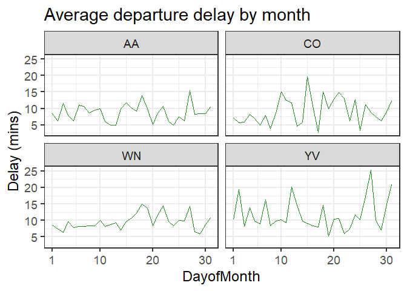<!-- -->

Day of Week

``` r
flights_day_week = depDelay_clean %>%
  filter(UniqueCarrier %in% airline_list) %>%
  group_by(UniqueCarrier, DayOfWeek) %>%
  summarize(avg_delay_mins = mean(DepDelay))
```

    ## `summarise()` regrouping output by 'UniqueCarrier' (override with `.groups` argument)

``` r
ggplot(flights_day_week, aes(x=DayOfWeek, y=avg_delay_mins)) + 
  geom_line( color='forest green') +
  geom_point( size=4, shape=21, fill="white") +
  facet_wrap(~ UniqueCarrier, nrow = 2) +
  theme_bw(base_size=18) +
  scale_x_continuous(breaks = 1:31) +
  labs(title = "Average departure delay by day of week", y="Delay (mins)")
```

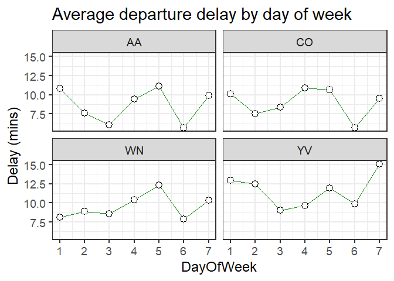<!-- -->

Delays during the morning

``` r
morning = subset(depDelay_clean, DepTime > 600 & DepTime < 1200)

flights_morning = morning %>%
  filter(UniqueCarrier %in% airline_list) %>%
  group_by(UniqueCarrier, DepTime) %>%
  summarize(avg_delay_mins = mean(DepDelay))
```

    ## `summarise()` regrouping output by 'UniqueCarrier' (override with `.groups` argument)

``` r
ggplot(flights_morning, aes(x=DepTime, y=avg_delay_mins)) + 
  geom_line( color='forest green') +
  facet_wrap(~ UniqueCarrier, nrow = 2) +
  theme_bw(base_size=18) +
  scale_x_continuous(breaks = c(600,700,800,900,1000,1100,1200)) +
  labs(title = "Average departure delay - morning", y="Delay (mins)")
```

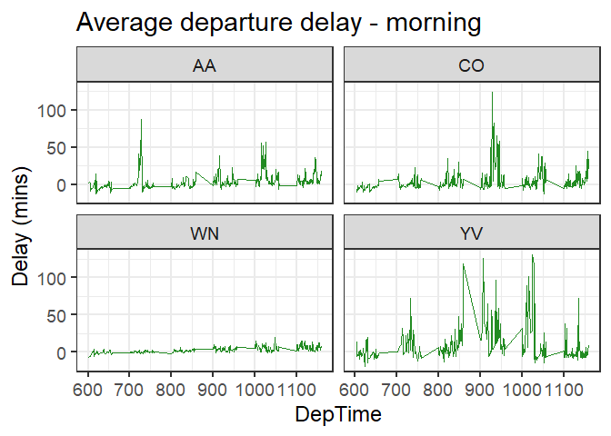<!-- -->

Delays during the afternoon

``` r
afternoon = subset(depDelay_clean, DepTime > 1200 & DepTime < 2000)

flights_afternoon = afternoon %>%
  filter(UniqueCarrier %in% airline_list) %>%
  group_by(UniqueCarrier, DepTime) %>%
  summarize(avg_delay_mins = mean(DepDelay))
```

    ## `summarise()` regrouping output by 'UniqueCarrier' (override with `.groups` argument)

``` r
ggplot(flights_afternoon, aes(x=DepTime, y=avg_delay_mins)) + 
  geom_line( color='forest green') +
  facet_wrap(~ UniqueCarrier, nrow = 2) +
  theme_bw(base_size=18) +
  scale_x_continuous(breaks = c(1200,1400,1600,1800,2000)) +
  labs(title = "Average departure delay - afternoon", y="Delay (mins)")
```

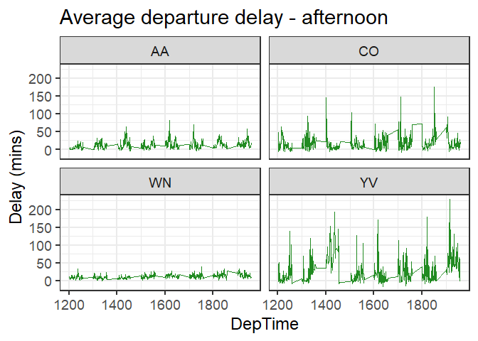<!-- -->

Lets examine the top 25 most popular airports. This will remove outliers
and noise from the data.

Which destinations are the worst in delaying when you arrive?

``` r
topdest = c('DAL', 'AUS','ATL','DEN','DFW','ELP','HOU','IAH','PHX','ORD','LAX','LAS','JFK','BNA','BWI','EWR','IAD','MDW','LBB','MCO','SAN','SFO','SJC','SLC','FLL')

arr_delay_dest = arrDelay_clean %>%
  filter(Dest %in% topdest) %>%
  group_by(Dest) %>%
  summarize(avg_delay_mins = mean(ArrDelay))
```

    ## `summarise()` ungrouping output (override with `.groups` argument)

``` r
ggplot(arr_delay_dest, aes(x=reorder(Dest, avg_delay_mins), y=avg_delay_mins)) + 
  geom_bar(stat='identity', color="forest green") +
  labs(title = "Average arrival delay by Destination", x="Delay (mins)", y="Top Destinations") +
  coord_flip()
```

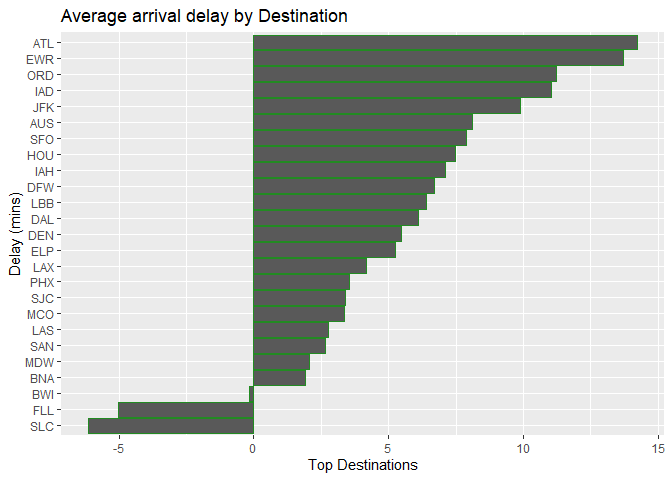<!-- -->

Which places are the worst to leave from in terms of departure delay?

``` r
dep_delay_org = depDelay_clean %>%
  filter(Origin %in% topdest) %>%
  group_by(Origin) %>%
  summarize(avg_delay_mins = mean(DepDelay))
```

    ## `summarise()` ungrouping output (override with `.groups` argument)

``` r
ggplot(dep_delay_org, aes(x=reorder(Origin, avg_delay_mins), y=avg_delay_mins)) + 
  geom_bar(stat='identity', color="forest green") +
  labs(title = "Average departure delay by Origin") +
  coord_flip()
```

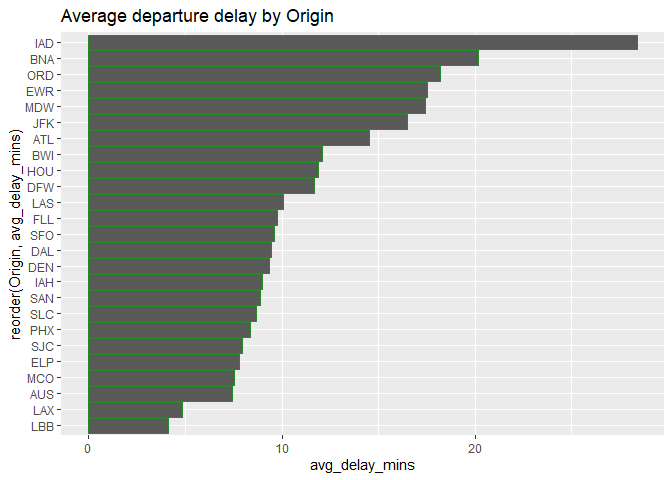<!-- -->

## Discussion

Looking into the trends can allow for planning around the worst
airlines, times or destinations for delays. The worst airlines to fly on
by both departure and arrival delay are EV, OH, and YH. US by far
performs the best in both categories. There is a slight trend with
flight time and arrival delay with longer flights showing more delay. It
is best to avoid traveling at the beginning or end of the business week
as these are popular times to fly. There are peaks in delays around 9
and 10 am. IAD, EWR, and ORD show up as high delays both in arrival and
departure whereas on the other side of the spectrum, FLL and SLC are
actually very negative in departure delays, meaning they tend to get out
early.

# Portfolio Modeling

We are creating 3 portfolio, each consisting of different weights of six
ETFs. The ETFs we chose are Vanguard S\&P 500 (VOO), SPDR Gold Trust
(GLD), iShares Dow Jones US Home Construction (ITB), iShares Russell
2000 (IWM), Principal Active Income (YLD), and iShares Core US Aggregate
Bond (AGG).

We chose these specific securities because they reflect a wide range of
asset classes that decrease overall exposure to risk. The VOO tracks
movements in the S\&P500, GLD tracks the price of gold, ITB tracks
companies involved in the production and sale of materials for home
construction, IWM tracks movements in the Rusell 2000, YLD provides
income from high yield bonds, and AGG tracks US investment-grade bonds.

### Returns of individual securities

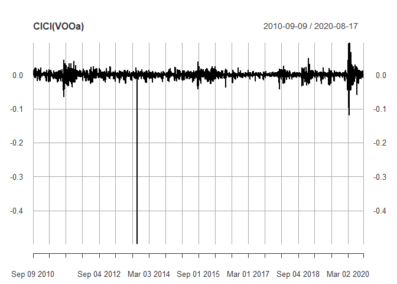<!-- -->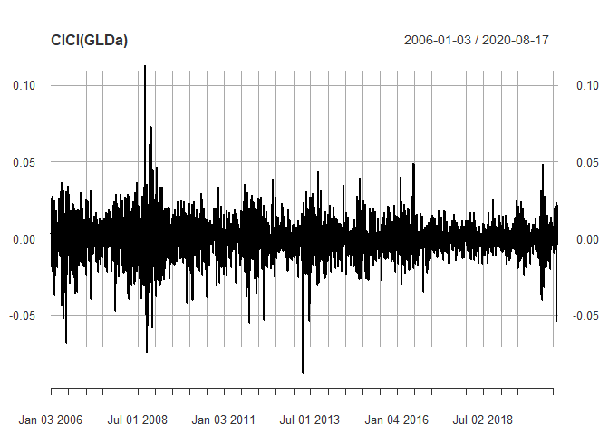<!-- -->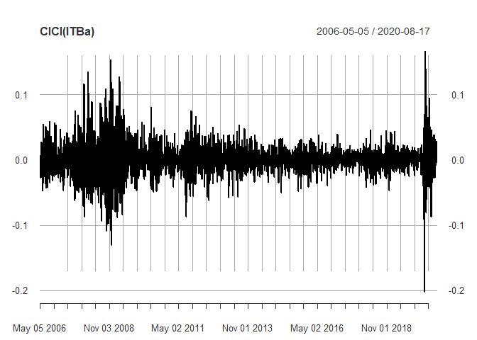<!-- -->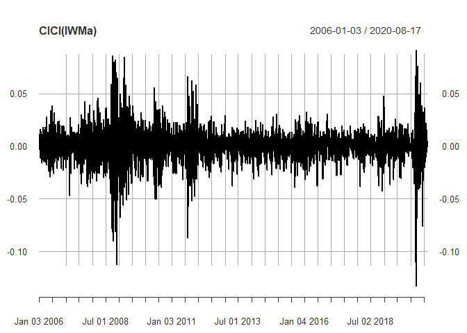<!-- -->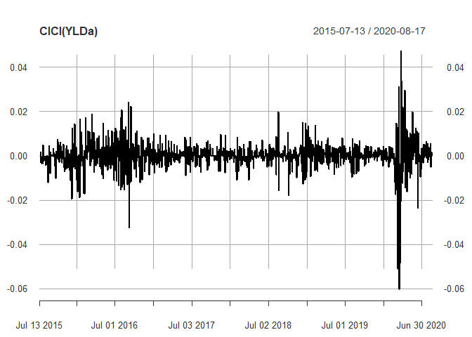<!-- -->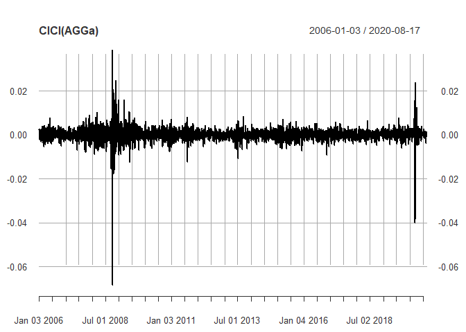<!-- -->

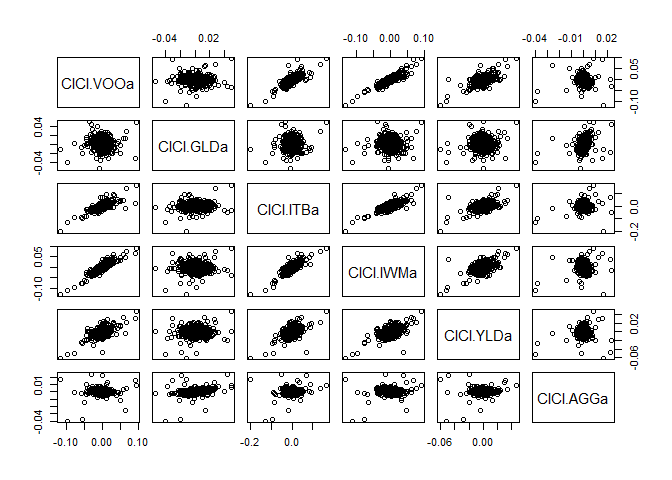<!-- -->

Pairwise correlation plots

### Create Portfolio with different weight vectors

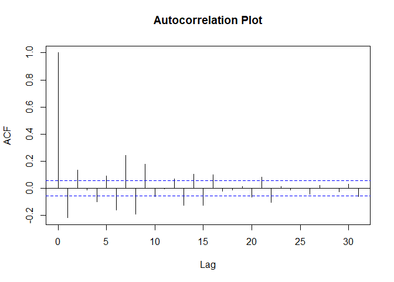<!-- -->

    ## starting httpd help server ... done

Capital asset pricing model assumption hold, returns are not correlated
with each other.

# Bootstapping

Bootstrap from 1 to 5000, 20-days of returns for each portfolio. The
weights of each security in each portfolio are as follows:

Portfolio 1:

    ## [1] "Portfolio 1 Weghts: 0.2, 0.2, 0.2, 0.2, 0.1, 0.1"

    ## [1] "                    VO0, GLD, ITB, IWMB, YLD, AGG"

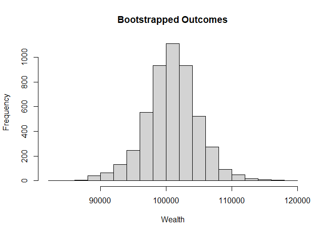<!-- -->

    ## [1] "Total wealth = $ 100866.33"

    ## [1] "Total Gain/Loss = $ 866.33"

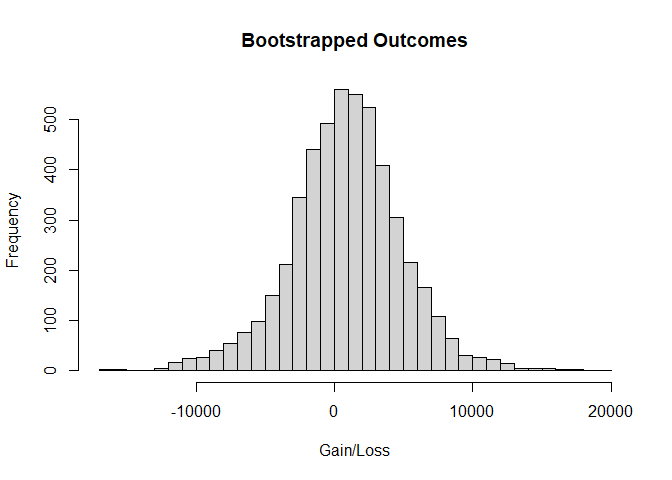<!-- -->

    ## [1] "Portfolio 1 value at risk (5%): 5935.16"

Portfolio 2:

    ## [1] "Portfolio 2 Weghts:  0.3, 0.0, 0.2, 0.2, 0.3, 0.0"

    ## [1] "                    VO0, GLD, ITB, IWMB, YLD, AGG"

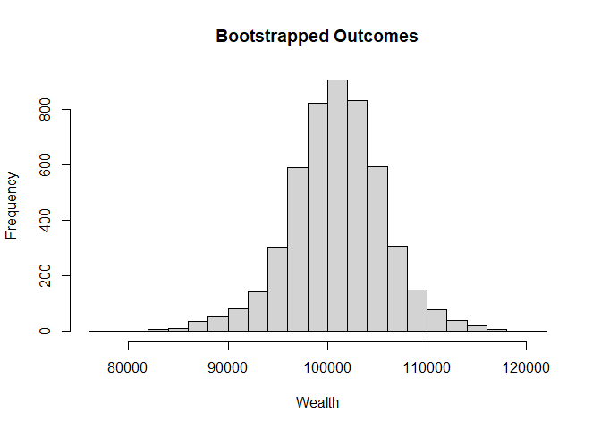<!-- -->

    ## [1] "Total wealth = $ 100893.96"

    ## [1] "Total Gain/Loss = $ 893.96"

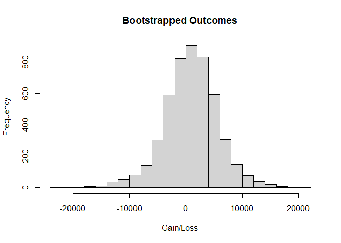<!-- -->

    ## [1] "Portfolio 2 value at risk (5%): 6988.81"

Portfolio 3:

    ## [1] "Portfolio 1 Weghts: 0.3, 0.2, 0.2, 0.1, 0.15, 0.05"

    ## [1] "                    VO0, GLD, ITB, IWMB, YLD, AGG"

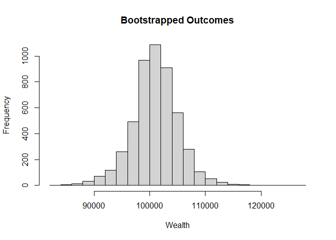<!-- -->

    ## [1] "Total wealth = $ 100988.67"

    ## [1] "Total Gain/Loss = $ 988.67"

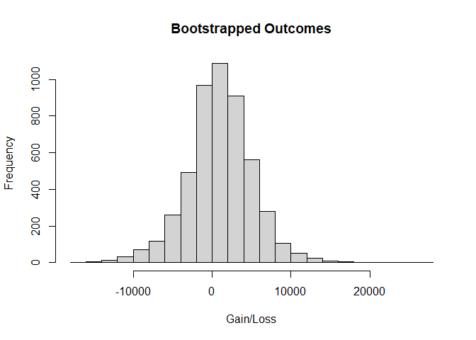<!-- -->

    ## [1] "Portfolio 3 value at risk (5%): 5919.18"

# Market Segmentation

We used a cluster analysis and a PCA analysis on to segment Twitter
followers of NutrientH2O.

We first cleaned up the data frame by excluding users that posted at
least one spam or adult tweet. We did this because these are users that
were posting unsolicited advertising or explicit content that went
undetected by Twitter bots. We did not want these users to skew our
data, and removing those observations provides a more accurate
representation of NutrientH2O’s followers. The users removed are those
whose tweet are characterized as spam, or adult. We also removed users
whose tweets are explicitly categorized as chatter or uncategorized.

### K-means Clustering

#### Model Selection

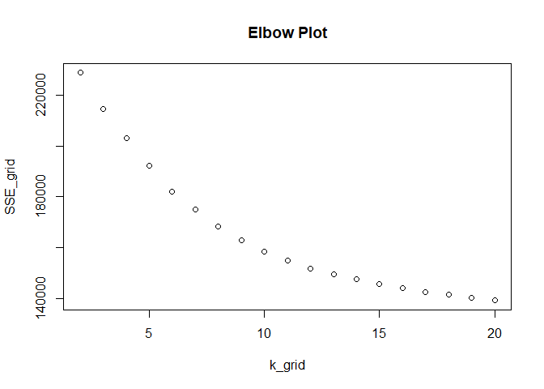<!-- -->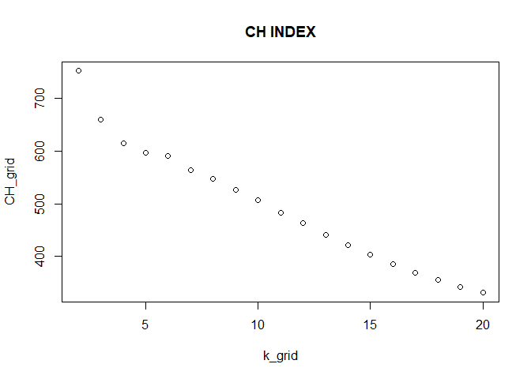<!-- -->

To choose k for a k-means and k-means++ model, we used an elbow plot and
the CH index. We chose a k of 4 because, we found that the greatest
reduction in SSE was between k=2 and k=5. We also attempted to use the
gap statistic, but it the bootstrapping required more processing than
our computers could handle.

### K-Means Clusters

    ##   current_events           travel    photo_sharing          tv_film 
    ##        1.4270686        1.0991301        2.1936071        0.9763302 
    ##    sports_fandom         politics             food           family 
    ##        0.9597410        0.9939308        0.7962776        0.5830467 
    ##  home_and_garden            music             news    online_gaming 
    ##        0.4323285        0.5480477        0.6896621        1.0950840 
    ##         shopping health_nutrition      college_uni   sports_playing 
    ##        1.1976532        1.3390653        1.4009711        0.5235687 
    ##          cooking              eco        computers         business 
    ##        0.9186729        0.3807404        0.3690067        0.3230831 
    ##         outdoors           crafts       automotive              art 
    ##        0.4509407        0.3592960        0.5781914        0.6146065 
    ##         religion           beauty        parenting           dating 
    ##        0.5162857        0.3406838        0.4521546        0.5152741 
    ##           school personal_fitness          fashion   small_business 
    ##        0.4468946        0.7881853        0.5146672        0.2696743

    ##   current_events           travel    photo_sharing          tv_film 
    ##        1.6685472        5.6064880        2.5359661        1.1622003 
    ##    sports_fandom         politics             food           family 
    ##        2.0239774        8.9421721        1.4485190        0.9337094 
    ##  home_and_garden            music             news    online_gaming 
    ##        0.6107193        0.6361072        5.3159379        1.1057828 
    ##         shopping health_nutrition      college_uni   sports_playing 
    ##        1.3864598        1.8519041        1.5416079        0.6995769 
    ##          cooking              eco        computers         business 
    ##        1.4005642        0.5825106        2.4781382        0.6629055 
    ##         outdoors           crafts       automotive              art 
    ##        0.9548660        0.6234133        2.3610719        0.6812412 
    ##         religion           beauty        parenting           dating 
    ##        1.0253879        0.5091678        0.9506347        1.0662906 
    ##           school personal_fitness          fashion   small_business 
    ##        0.7136812        1.1015515        0.7362482        0.4682652

    ##   current_events           travel    photo_sharing          tv_film 
    ##        1.7138749        1.3788641        4.6010065        1.3443566 
    ##    sports_fandom         politics             food           family 
    ##        1.1861970        1.3091301        1.7145938        0.8950395 
    ##  home_and_garden            music             news    online_gaming 
    ##        0.7074047        1.1301222        1.0424155        1.6189792 
    ##         shopping health_nutrition      college_uni   sports_playing 
    ##        2.0366643        7.6132279        2.1042416        0.9424874 
    ##          cooking              eco        computers         business 
    ##        6.3112868        0.8461538        0.6448598        0.6189792 
    ##         outdoors           crafts       automotive              art 
    ##        1.8957584        0.6937455        0.8181165        1.0165349 
    ##         religion           beauty        parenting           dating 
    ##        0.8109274        1.8785047        0.7929547        1.2012940 
    ##           school personal_fitness          fashion   small_business 
    ##        0.8497484        4.1373113        2.8166786        0.4601006

    ##   current_events           travel    photo_sharing          tv_film 
    ##        1.6696091        1.3366961        2.6494325        1.1059269 
    ##    sports_fandom         politics             food           family 
    ##        5.8587642        1.1614124        4.5397226        2.5006305 
    ##  home_and_garden            music             news    online_gaming 
    ##        0.6506936        0.7503153        1.0315259        1.2723834 
    ##         shopping health_nutrition      college_uni   sports_playing 
    ##        1.4728878        2.0113493        1.4880202        0.7793190 
    ##          cooking              eco        computers         business 
    ##        1.7036570        0.6645649        0.7427491        0.5031526 
    ##         outdoors           crafts       automotive              art 
    ##        0.7250946        1.0731400        1.0390921        0.9054224 
    ##         religion           beauty        parenting           dating 
    ##        5.2522068        1.1046658        4.0252207        0.7515763 
    ##           school personal_fitness          fashion   small_business 
    ##        2.6645649        1.2849937        1.0428752        0.4035309

### K-means++ Clusters

    ##   current_events           travel    photo_sharing          tv_film 
    ##        1.7138749        1.3788641        4.6010065        1.3443566 
    ##    sports_fandom         politics             food           family 
    ##        1.1861970        1.3091301        1.7145938        0.8950395 
    ##  home_and_garden            music             news    online_gaming 
    ##        0.7074047        1.1301222        1.0424155        1.6189792 
    ##         shopping health_nutrition      college_uni   sports_playing 
    ##        2.0366643        7.6132279        2.1042416        0.9424874 
    ##          cooking              eco        computers         business 
    ##        6.3112868        0.8461538        0.6448598        0.6189792 
    ##         outdoors           crafts       automotive              art 
    ##        1.8957584        0.6937455        0.8181165        1.0165349 
    ##         religion           beauty        parenting           dating 
    ##        0.8109274        1.8785047        0.7929547        1.2012940 
    ##           school personal_fitness          fashion   small_business 
    ##        0.8497484        4.1373113        2.8166786        0.4601006

    ##   current_events           travel    photo_sharing          tv_film 
    ##        1.6685472        5.6064880        2.5359661        1.1622003 
    ##    sports_fandom         politics             food           family 
    ##        2.0239774        8.9421721        1.4485190        0.9337094 
    ##  home_and_garden            music             news    online_gaming 
    ##        0.6107193        0.6361072        5.3159379        1.1057828 
    ##         shopping health_nutrition      college_uni   sports_playing 
    ##        1.3864598        1.8519041        1.5416079        0.6995769 
    ##          cooking              eco        computers         business 
    ##        1.4005642        0.5825106        2.4781382        0.6629055 
    ##         outdoors           crafts       automotive              art 
    ##        0.9548660        0.6234133        2.3610719        0.6812412 
    ##         religion           beauty        parenting           dating 
    ##        1.0253879        0.5091678        0.9506347        1.0662906 
    ##           school personal_fitness          fashion   small_business 
    ##        0.7136812        1.1015515        0.7362482        0.4682652

    ##   current_events           travel    photo_sharing          tv_film 
    ##        1.4270686        1.0991301        2.1936071        0.9763302 
    ##    sports_fandom         politics             food           family 
    ##        0.9597410        0.9939308        0.7962776        0.5830467 
    ##  home_and_garden            music             news    online_gaming 
    ##        0.4323285        0.5480477        0.6896621        1.0950840 
    ##         shopping health_nutrition      college_uni   sports_playing 
    ##        1.1976532        1.3390653        1.4009711        0.5235687 
    ##          cooking              eco        computers         business 
    ##        0.9186729        0.3807404        0.3690067        0.3230831 
    ##         outdoors           crafts       automotive              art 
    ##        0.4509407        0.3592960        0.5781914        0.6146065 
    ##         religion           beauty        parenting           dating 
    ##        0.5162857        0.3406838        0.4521546        0.5152741 
    ##           school personal_fitness          fashion   small_business 
    ##        0.4468946        0.7881853        0.5146672        0.2696743

    ##   current_events           travel    photo_sharing          tv_film 
    ##        1.6696091        1.3366961        2.6494325        1.1059269 
    ##    sports_fandom         politics             food           family 
    ##        5.8587642        1.1614124        4.5397226        2.5006305 
    ##  home_and_garden            music             news    online_gaming 
    ##        0.6506936        0.7503153        1.0315259        1.2723834 
    ##         shopping health_nutrition      college_uni   sports_playing 
    ##        1.4728878        2.0113493        1.4880202        0.7793190 
    ##          cooking              eco        computers         business 
    ##        1.7036570        0.6645649        0.7427491        0.5031526 
    ##         outdoors           crafts       automotive              art 
    ##        0.7250946        1.0731400        1.0390921        0.9054224 
    ##         religion           beauty        parenting           dating 
    ##        5.2522068        1.1046658        4.0252207        0.7515763 
    ##           school personal_fitness          fashion   small_business 
    ##        2.6645649        1.2849937        1.0428752        0.4035309

    ## [1] "K-means within cluster sum of squares:  84091.4947824985"
    ## [2] "K-means within cluster sum of squares:  28720.6908195709"
    ## [3] "K-means within cluster sum of squares:  60745.798141806" 
    ## [4] "K-means within cluster sum of squares:  29418.7052139752"

    ## [1] "K-means++ within cluster sum of squares:  60745.798141806" 
    ## [2] "K-means++ within cluster sum of squares:  28720.6908195709"
    ## [3] "K-means++ within cluster sum of squares:  84091.4947824985"
    ## [4] "K-means++ within cluster sum of squares:  29418.7052139752"

    ## [1] "K-means total within cluster sum of squares:  202976.688957851"

    ## [1] "K-means++ total within cluster sum of squares:  202976.688957851"

    ## [1] "K-means total between cluster sum of squares:  47743.3110421491"

    ## [1] "K-means++ total between cluster sum of squares:  47743.3110421491"

    ## [1] "There is very little variation between the clusters obtained through K-means and K-means++ with 4 clusters"

### PCA

    ## Importance of first k=5 (out of 32) components:
    ##                           PC1    PC2    PC3     PC4     PC5
    ## Standard deviation     4.1577 2.9078 2.3695 0.40762 0.37814
    ## Proportion of Variance 0.5402 0.2642 0.1754 0.00519 0.00447
    ## Cumulative Proportion  0.5402 0.8044 0.9799 0.98509 0.98956

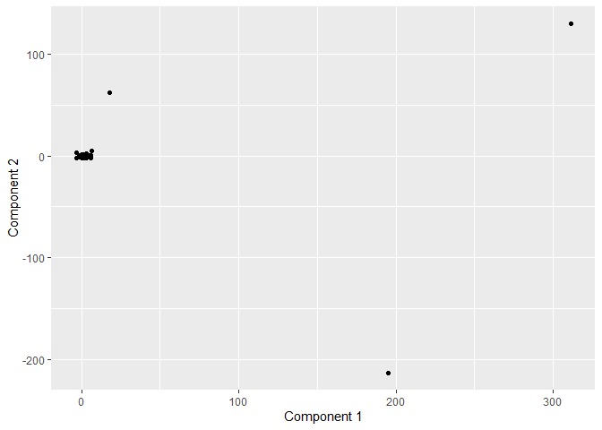<!-- -->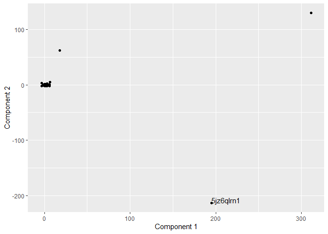<!-- -->

#### Most Common Loadings in each Component:

    ## [1] "Component 1 top 4:"

    ## [1] "business" "eco"      "beauty"   "shopping"

    ## [1] "Component 1 bottom 4:"

    ## [1] "parenting"      "current_events" "online_gaming"  "news"

    ## [1] "Component 2 top 4:"

    ## [1] "dating"          "home_and_garden" "fashion"         "music"

    ## [1] "Component 4 bottom 4:"

    ## [1] "school"        "shopping"      "college_uni"   "photo_sharing"

    ## [1] "Component 3 top 4:"

    ## [1] "family"        "sports_fandom" "school"        "college_uni"

    ## [1] "Component 3 bottom 4:"

    ## [1] "crafts"    "travel"    "computers" "politics"

    ## [1] "Component 4 top 4:"

    ## [1] "personal_fitness" "health_nutrition" "outdoors"         "music"

    ## [1] "Component 4 bottom 4:"

    ## [1] "religion"      "art"           "tv_film"       "sports_fandom"

    ## [1] "Component 5 top 4:"

    ## [1] "personal_fitness" "health_nutrition" "outdoors"         "music"

    ## [1] "Component 5 bottom 4:"

    ## [1] "religion"      "art"           "tv_film"       "sports_fandom"

### Discussion of Analysis

After scaling the variables by frequency, the k-means and k-means++
defined the 4 clusters as such:

1.  Health and nutrition, cooking, personal fitness, photo sharing,
    fashion, college\_uni

2.  Photo sharing, current events, college\_uni, travel

3.  Politics, travel, news, photo sharing, computers, automotive,
    sports\_fandom

4.  Sports\_fandom, religion, parenting, school, photo\_sharing, family

From a top-level view, we can identify potential demographics and
segment them into subsets based on their particular interests. The first
potential target audience is college students which was indicated by
tweets under the “college\_uni” label. This label was often clustered
with health and nutrition, cooking, personal fitness, and photo sharing.
We can identify a potential market segment as college-aged females, like
those in sororities, since they often times set fashion trends through
photo sharing where they also highlight health-consciousness and healthy
eating. Because health awareness in this demographic is so significant,
sleeker “zero calorie” products would also be well-received.

A second subset of college students could be study abroad or
international students, as the “college\_uni” tag was also clustered
with photo sharing, current events, and travel. Individuals also
interested in travel and current events could also be interested in
designs that keep utility in mind and could be indicative of a following
in other countries. NutrientH2O could therefore investigate this further
by investing in their international marketing and maybe consider selling
their products in travel hubs like airports.

The third subset includes several users that tweet a lot about politics,
travel, and news, along with computers, automotives, and sports. These
individuals could also be college students, specifically, male college
students or young professionals. Individuals interested in these topics
can often be found in college business fraternities. Because the
demographic is similar to the sorority segment, a more electrolyte-rich,
masculine design would likely be well-received by this target audience.

The fourth and final cluster consists of seemingly religious parents of
school-age children who are also sports fans. The sorority design could
therefore be applied to health conscious, upper-class, stay-at-home
mothers. Conversely, the masculine, fraternity design could also appeal
to fathers in their mid-30s who may enjoy congregating for sports events
and barbecues.

### Takeaway

Because many of the market segments consist of college-aged individuals
who may be a part of student organizations such as sororities or
fraternities, and there are clusters of older individuals who tweet a
lot about religion and politics, marketing to upper-class and likely
conservative individuals would benefit NutrientH2O’s brand.

NutrientH2O should have an image that appeals mostly to young adults,
but that is also inclusive of parents of school-age children. We
recommend enhancing the product’s image of trendiness, healthiness, and
portability. This can be achieved through direct marketing to these
clusters.

``` r
print('All loadings:')
```

    ## [1] "All loadings:"

``` r
loadings
```

    ##                          PC1          PC2          PC3          PC4
    ## current_events   -0.22757575 -0.102299838 -0.004516225 -0.121729461
    ## travel           -0.12909925  0.043154935 -0.350432458 -0.098475467
    ## photo_sharing     0.10402423 -0.306683252  0.046959260  0.037720440
    ## tv_film          -0.14095848  0.268749341 -0.056575219 -0.204492944
    ## sports_fandom    -0.07312084 -0.143565205  0.351429078 -0.390704747
    ## politics         -0.07756387 -0.068365550 -0.389101745 -0.055554264
    ## food             -0.22231219  0.063171300  0.136692710 -0.017364774
    ## family            0.10988362  0.055289171  0.358970748 -0.161691046
    ## home_and_garden   0.07238181  0.324469587  0.035981823 -0.141568632
    ## music             0.13906942  0.277019053 -0.011151003  0.162027434
    ## news             -0.23644865  0.044216920  0.030748163 -0.054311113
    ## online_gaming    -0.22970981  0.040702009  0.029477604 -0.067918054
    ## shopping          0.18273315 -0.214041622  0.078210038  0.048969069
    ## health_nutrition -0.19931968  0.138565058  0.141218495  0.432979038
    ## college_uni      -0.08499738 -0.290869755  0.145839336  0.012977704
    ## sports_playing   -0.22157928  0.062437832  0.133839370  0.023226920
    ## cooking           0.16150516  0.253064517  0.021321084  0.029445121
    ## eco               0.21819218 -0.061390867 -0.136483426  0.143640382
    ## computers        -0.10838542 -0.059292714 -0.367496215 -0.105025296
    ## business          0.23376274 -0.018675787  0.087381353 -0.003461326
    ## outdoors         -0.22075135  0.062976981  0.134980532  0.305478892
    ## crafts           -0.18064898 -0.028087307 -0.273423200 -0.021189401
    ## automotive       -0.22079514  0.062592336  0.135342027  0.039983543
    ## art              -0.22040365  0.063250238  0.135046326 -0.186898188
    ## religion         -0.22075696  0.062679090  0.137112754 -0.186692806
    ## beauty            0.21188500  0.160161835 -0.028416652  0.007773627
    ## parenting        -0.22554624  0.007044858 -0.139099996 -0.154745055
    ## dating           -0.01287873  0.332100485  0.084831994 -0.006374164
    ## school            0.16577010 -0.198096128  0.179939350 -0.137006251
    ## personal_fitness -0.21880637 -0.084948175  0.099837439  0.512718190
    ## fashion           0.08068185  0.320517025  0.029149927 -0.017991885
    ## small_business    0.14137800  0.276497805 -0.013928149 -0.043760474
    ##                           PC5
    ## current_events    0.033657452
    ## travel           -0.049398641
    ## photo_sharing     0.006913429
    ## tv_film           0.042716469
    ## sports_fandom    -0.144534587
    ## politics         -0.091610681
    ## food             -0.052674799
    ## family           -0.260791250
    ## home_and_garden   0.049292271
    ## music             0.084265033
    ## news             -0.074185077
    ## online_gaming     0.637034281
    ## shopping         -0.004910406
    ## health_nutrition -0.126875653
    ## college_uni       0.456739771
    ## sports_playing    0.287095195
    ## cooking           0.051796666
    ## eco               0.055679955
    ## computers        -0.117255870
    ## business         -0.011092233
    ## outdoors         -0.052940137
    ## crafts           -0.152589149
    ## automotive       -0.009757720
    ## art              -0.104095620
    ## religion         -0.160997587
    ## beauty            0.030444670
    ## parenting        -0.080953474
    ## dating           -0.099425763
    ## school           -0.110633432
    ## personal_fitness -0.204039041
    ## fashion           0.103447255
    ## small_business    0.044167074

# Author Attribution

First, we will load the libraries needed to read in each author and
their articles, parse the article sentences into unique words, and build
the word frequency matrices.

``` r
rm(list=ls())

library(tm) 
```

    ## Loading required package: NLP

    ## 
    ## Attaching package: 'NLP'

    ## The following object is masked from 'package:ggplot2':
    ## 
    ##     annotate

    ## 
    ## Attaching package: 'tm'

    ## The following object is masked from 'package:mosaic':
    ## 
    ##     inspect

``` r
library(tidyverse)
library(slam)
library(proxy)
```

    ## 
    ## Attaching package: 'proxy'

    ## The following object is masked from 'package:Matrix':
    ## 
    ##     as.matrix

    ## The following objects are masked from 'package:stats':
    ## 
    ##     as.dist, dist

    ## The following object is masked from 'package:base':
    ## 
    ##     as.matrix

Now, we need a function to read the a plain text document in English.

``` r
readerPlain = function(fname){
                readPlain(elem=list(content=readLines(fname)), 
                            id=fname, language='en')}
```

## Reading in the Data

We will now “glob” all of the articles for each author in the train and
test datasets. Then we will apply are plain text reader function to read
each of the articles.

``` r
file_list = Sys.glob('~/MSBAsummer20/STA380-master/data/ReutersC50/*/*/*.txt')
full_set = lapply(file_list, readerPlain)
```

Since we read all of the articles in at once, the test articles were
read in first, then the train articles. Let’s check to make sure that
the last “test” article is at row 2500 and the first “train” articles is
at row 2501.

``` r
file_list[2500]
```

    ## [1] "C:/Users/Jake Johnson/Documents/MSBAsummer20/STA380-master/data/ReutersC50/C50test/WilliamKazer/58312newsML.txt"

``` r
file_list[2501]
```

    ## [1] "C:/Users/Jake Johnson/Documents/MSBAsummer20/STA380-master/data/ReutersC50/C50train/AaronPressman/106247newsML.txt"

With that varified, now we can clean up teh file names to just show the
author name. This will help us later when we attribute the test articles
to a specificy author.

``` r
mynames = file_list %>%
  { strsplit(., '/', fixed=TRUE) } %>%
  { lapply(., function(x) x[length(x) -1])} %>%
  unlist
```

Let’s look at the names to make sure they are pretty and then rename our
articles.

``` r
print(mynames[1:10])
```

    ##  [1] "AaronPressman" "AaronPressman" "AaronPressman" "AaronPressman"
    ##  [5] "AaronPressman" "AaronPressman" "AaronPressman" "AaronPressman"
    ##  [9] "AaronPressman" "AaronPressman"

``` r
names(full_set) = mynames
```

## Create the Corpus

Now we need to create the Corpus (i.e. the body of text) with which we
are going to use in our analysis.

``` r
documents_raw = Corpus(VectorSource(full_set))
```

## Data Pre-Processing

With the raw text data in hand, we need to do some pre-processing to
make it suitable for analysis. We will make everything lowercase, remove
numbers and punctuation, and remove excess whitespace.

``` r
my_documents = documents_raw %>%
  tm_map(content_transformer(tolower))  %>%       
  # make everything lowercase
  tm_map(content_transformer(removeNumbers)) %>%  
  # remove numbers
  tm_map(content_transformer(removePunctuation)) %>%  
  # remove punctuation
  tm_map(content_transformer(stripWhitespace))          
```

    ## Warning in tm_map.SimpleCorpus(., content_transformer(tolower)): transformation
    ## drops documents

    ## Warning in tm_map.SimpleCorpus(., content_transformer(removeNumbers)):
    ## transformation drops documents

    ## Warning in tm_map.SimpleCorpus(., content_transformer(removePunctuation)):
    ## transformation drops documents

    ## Warning in tm_map.SimpleCorpus(., content_transformer(stripWhitespace)):
    ## transformation drops documents

``` r
  # remove excess white-space
```

Now we need to remove “stopwords” from the text. In this context,
“stopwords” are very common words that fill up text like, “the”, “a”,
“it”, etc. Removing these words helps distinguish the more important
words in the text. In our case, we will be removing “stopwords” from the
SMART information retrieval system.

``` r
my_documents = tm_map(my_documents,
                      content_transformer(removeWords),
                      stopwords("SMART"))
```

    ## Warning in tm_map.SimpleCorpus(my_documents, content_transformer(removeWords), :
    ## transformation drops documents

## Document-term-matrix and TF-IDF Weighting

Now we will create a doc-term-matrix (DTM). The rows of the matrix
represent a particular document, while the columns represent the words
found in the documents. Each cell is a count of how may times a word
appears in a document.

``` r
DTM_full_set = DocumentTermMatrix(my_documents)

# looking at th first 10 rows of the first 5 terms
inspect(DTM_full_set[1:10,1:5])
```

    ## <<DocumentTermMatrix (documents: 10, terms: 5)>>
    ## Non-/sparse entries: 10/40
    ## Sparsity           : 80%
    ## Maximal term length: 10
    ## Weighting          : term frequency (tf)
    ## Sample             :
    ##     Terms
    ## Docs aaron abandon account accounting added
    ##   1      1       1       1          3     3
    ##   10     0       0       0          0     1
    ##   2      0       0       0          0     0
    ##   3      0       0       0          0     0
    ##   4      0       0       0          0     0
    ##   5      1       0       0          0     1
    ##   6      0       0       0          0     0
    ##   7      0       0       0          0     0
    ##   8      1       0       0          0     0
    ##   9      1       0       0          0     0

We can also look at the most frequent terms with a minimum of 5000
counts…

``` r
findFreqTerms(DTM_full_set, 5000)
```

    ##  [1] "character"     "cusersjake"    "datetimestamp" "description"  
    ##  [5] "heading"       "hour"          "isdst"         "language"     
    ##  [9] "listcontent"   "mday"          "meta"          "million"      
    ## [13] "min"           "mon"           "origin"        "wday"         
    ## [17] "yday"          "year"          "company"       "percent"      
    ## [21] "market"        "billion"

We will drop terms that sparse. However, we will keep most of the terms
present since we are going to run Principle Components Analysis (PCA)
and we want to preserve as much information as possible.

We are removing terms that have more than 99% 0 values. This effectively
drops words that only appear in one or two documents.

``` r
DTM_full_set = removeSparseTerms(DTM_full_set, 0.99)
DTM_full_set
```

    ## <<DocumentTermMatrix (documents: 5000, terms: 3131)>>
    ## Non-/sparse entries: 722057/14932943
    ## Sparsity           : 95%
    ## Maximal term length: 18
    ## Weighting          : term frequency (tf)

Now we are going to weight the terms of our DTM using the TF-IDF method.
This will weight words that appear frequently in documents but are rare
in the entire corpus of text. For example, if the word “trade” appears
in all of the documents, then it will not be weighted heavily, since
that word does not help distinguish the articles from one another. On
the other hand, if one or two documents use the word “brexit” while no
other documents use it, this word gets a heavier weight since it
distinguishes those particular documents from the rest.

``` r
tfidf_full_set = weightTfIdf(DTM_full_set)
tfidf_full_set
```

    ## <<DocumentTermMatrix (documents: 5000, terms: 3131)>>
    ## Non-/sparse entries: 637057/15017943
    ## Sparsity           : 96%
    ## Maximal term length: 18
    ## Weighting          : term frequency - inverse document frequency (normalized) (tf-idf)

## Principle Component Analysis

Now that we have a matrix of terms weighted by their importance to a
specific document, we can use these terms to try and find authors who of
similar articles. However, we have over 3000 terms in our matrix. This
high of dimensionality is likely to cause noise in our predictive model
and confuse our results. To work around this issue, we will run PCA to
construct new variables for our predictive model. These summaries of the
term matrix will help preserve as much information from the Corpus
without having too high of dimenionlity.

``` r
X = as.matrix(tfidf_full_set)

# remove sparse columns
scrub_cols = which(colSums(X) == 0)
X = X[,-scrub_cols]

# taking the top 600 PCs
pca_full_set = prcomp(X, scale=TRUE, rank. = 600)
```

We can look at some of the loadings of the frist two PCs…

``` r
pca_full_set$rotation[order(abs(pca_full_set$rotation[,1]),
                            decreasing=TRUE),1][1:25]
```

    ##      beijing        china       leader         hong       chinas      chinese 
    ##   0.10486717   0.09954439   0.09381579   0.09153256   0.09007958   0.08925458 
    ##    political         kong     beijings        kongs    communist         rule 
    ##   0.08582722   0.08536609   0.08255057   0.08168573   0.08089616   0.07887310 
    ## prodemocracy        party      cheehwa    democracy      million       colony 
    ##   0.07729777   0.07710596   0.07504112   0.07475278  -0.07454074   0.07337786 
    ##      percent    territory   democratic        share     handover       rights 
    ##  -0.07239287   0.07100543   0.07099397  -0.06878747   0.06845206   0.06808560 
    ##  legislature 
    ##   0.06752282

``` r
pca_full_set$rotation[order(abs(pca_full_set$rotation[,2]),
                            decreasing=TRUE),2][1:25]
```

    ##          index           corp         points         stocks        percent 
    ##     0.08690214    -0.08202993     0.07886919     0.07584102     0.07491991 
    ##            uaw      composite communications           auto     subindices 
    ##    -0.06960824     0.06901945    -0.06858640    -0.06806694     0.06786598 
    ##       internet           rise       forecast       torontos         plants 
    ##    -0.06770847     0.06583691     0.06525973     0.06479935    -0.06424111 
    ##           mich        workers        figures           rose         prices 
    ##    -0.06414945    -0.06283055     0.06275594     0.06235611     0.06232948 
    ##       computer        service            gms        company          parts 
    ##    -0.06060037    -0.05925483    -0.05877762    -0.05839449    -0.05757676

## Train and Test Data

With out principle components made, we can now split the data into test
and train data. The first 2500 documents were from the test articles and
the second half of the Corpus was from the train articles.

We will only use the first 300 PCs in our train and test data.

``` r
# get the test data
X_test = pca_full_set$x[1:2500,1:300] # 300 PCs
y_test = {mynames[1:2500]}

# put test data in a data frame
test_data = data.frame(y_test,X_test)
test_data$y_test = factor(test_data$y_test) # making the y variable a factor

# get train data
X_train = pca_full_set$x[2501:5000,1:300] # 300 PCs
y_train = {mynames[2501:5000]}

# put train data in a dataframe
train_data = data.frame(y_train,X_train)
train_data$y_train = factor(train_data$y_train) # making the y variable a factor
```

## Model Building and Selection

### KNN Classifier

Let’s begin by using a KNN classifier to predict the authors for the
test articles.

``` r
library(class)

knn.pred=knn(X_train, 
             X_test, 
             y_train,
             k=7) # 1 nearest neighbors

mean(knn.pred==y_test)
```

    ## [1] 0.5496

The KNN classifier, with 7 nearest neighbors, produced a 54% accuracy on
the test data. Keep in mind, the naive rule for classifying any author
would give an accuracy of 2% (1/50). So, the model is not fantastic, but
it is significantly better than randomly guessing the author.

### Random Forest Classifier

Let’s try a random forest classifier with 1000 trees. The number of
variables considered at each tree is the square room of *P* with *P*
being the number of variables in the model.

``` r
library(randomForest)
```

    ## randomForest 4.6-14

    ## Type rfNews() to see new features/changes/bug fixes.

    ## 
    ## Attaching package: 'randomForest'

    ## The following object is masked from 'package:ggplot2':
    ## 
    ##     margin

    ## The following object is masked from 'package:dplyr':
    ## 
    ##     combine

``` r
rffit = randomForest(y_train~.,
                     data=train_data,
                     ntree=1000)

# A confusion matrix of y-hat and test_y
CM = table(predict(rffit, newdata = test_data), test_data$y_test)

# summing the diagonals and dividing by the total
test_accuracy = (sum(diag(CM)))/sum(CM)

test_accuracy
```

    ## [1] 0.6124

The random forest preformed better than the KNN model, with about a 60%
accuracy on the test data.

### Support Vector Machine

Finally, we will fit a support vector machine (SVM) to predict the
authors of our test data.

``` r
library(e1071)

svmfit = svm(y_train~., 
             data=train_data, 
             kernel ="sigmoid", # tanh(gamma*u'*v + coef0)
             cross = 10, # k-fold k=10 cross validation
             cost = 1) # cost of constraint violation

# A confusion matrix of y-hat and test_y
CM = table(predict(svmfit,newdata = test_data),test_data$y_test)

test_accuracy = (sum(diag(CM)))/sum(CM)

test_accuracy
```

    ## [1] 0.6224

With the SVM we got slightly better results than the random forest with
an accuracy of about 62% on the test data.

# Association rule mining

This data set contains 9835 baskets of groceries. The most frequent
items are seen below with a minimum support of 0.1 meaning they show up
in 10% of all baskets.

``` r
rm(list = ls())

library(arules)
```

    ## 
    ## Attaching package: 'arules'

    ## The following object is masked from 'package:tm':
    ## 
    ##     inspect

    ## The following objects are masked from 'package:mosaic':
    ## 
    ##     inspect, lhs, rhs

    ## The following object is masked from 'package:dplyr':
    ## 
    ##     recode

    ## The following objects are masked from 'package:base':
    ## 
    ##     abbreviate, write

``` r
library(arulesViz)
```

    ## Loading required package: grid

    ## Registered S3 methods overwritten by 'registry':
    ##   method               from 
    ##   print.registry_field proxy
    ##   print.registry_entry proxy

    ## Registered S3 method overwritten by 'seriation':
    ##   method         from 
    ##   reorder.hclust gclus

``` r
groceries = read.transactions("~/MSBAsummer20/STA380-master/data/groceries.txt", rm.duplicates=TRUE, format="basket", sep=",")
itemFrequencyPlot(groceries, support=0.1)
```

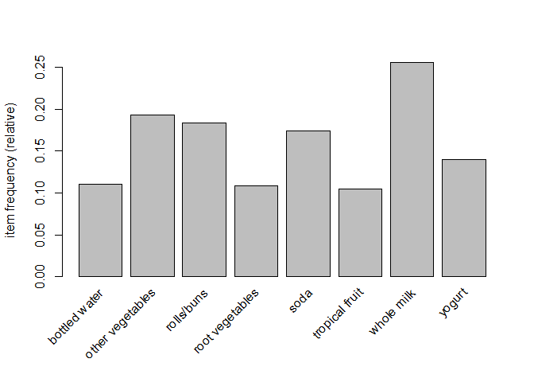<!-- -->

Next, lets examine the most common rules seen in the shopping trends
with a support of 0.05 and a confidence of 0.1. Confidence indicates how
often the rule is true, so this will give us rules that will be true 10%
of the time. A high support and confidence will select out the most
common purchases made together most of the time. From this subset, we
sort the top 10 by lift to examine the rules that have the strongest
correlations between the left hand items and right hand items of the
rule.

``` r
grocery_rules = apriori(groceries, parameter=list(support=.05, confidence=.1))
```

    ## Apriori
    ## 
    ## Parameter specification:
    ##  confidence minval smax arem  aval originalSupport maxtime support minlen
    ##         0.1    0.1    1 none FALSE            TRUE       5    0.05      1
    ##  maxlen target  ext
    ##      10  rules TRUE
    ## 
    ## Algorithmic control:
    ##  filter tree heap memopt load sort verbose
    ##     0.1 TRUE TRUE  FALSE TRUE    2    TRUE
    ## 
    ## Absolute minimum support count: 491 
    ## 
    ## set item appearances ...[0 item(s)] done [0.00s].
    ## set transactions ...[169 item(s), 9835 transaction(s)] done [0.00s].
    ## sorting and recoding items ... [28 item(s)] done [0.00s].
    ## creating transaction tree ... done [0.00s].
    ## checking subsets of size 1 2 done [0.00s].
    ## writing ... [14 rule(s)] done [0.00s].
    ## creating S4 object  ... done [0.00s].

``` r
inspect(head(sort(grocery_rules, by = "lift"), 10))
```

    ##      lhs                   rhs                support    confidence coverage 
    ## [1]  {yogurt}           => {whole milk}       0.05602440 0.4016035  0.1395018
    ## [2]  {whole milk}       => {yogurt}           0.05602440 0.2192598  0.2555160
    ## [3]  {other vegetables} => {whole milk}       0.07483477 0.3867578  0.1934926
    ## [4]  {whole milk}       => {other vegetables} 0.07483477 0.2928770  0.2555160
    ## [5]  {rolls/buns}       => {whole milk}       0.05663447 0.3079049  0.1839349
    ## [6]  {whole milk}       => {rolls/buns}       0.05663447 0.2216474  0.2555160
    ## [7]  {}                 => {yogurt}           0.13950178 0.1395018  1.0000000
    ## [8]  {}                 => {rolls/buns}       0.18393493 0.1839349  1.0000000
    ## [9]  {}                 => {bottled water}    0.11052364 0.1105236  1.0000000
    ## [10] {}                 => {tropical fruit}   0.10493137 0.1049314  1.0000000
    ##      lift     count
    ## [1]  1.571735  551 
    ## [2]  1.571735  551 
    ## [3]  1.513634  736 
    ## [4]  1.513634  736 
    ## [5]  1.205032  557 
    ## [6]  1.205032  557 
    ## [7]  1.000000 1372 
    ## [8]  1.000000 1809 
    ## [9]  1.000000 1087 
    ## [10] 1.000000 1032

## Whole Milk Subset

Focusing on the most common item, whole milk, we generate a set of rules
with a support of 0.001 and a confidence of 0.08. Selecting a unique
subset, we lower the support but only lower the confidence slightly to
keep strong rules.

``` r
milk_rules <- apriori(data=groceries, parameter=list (supp=0.001,conf = 0.08), appearance = list (rhs="whole milk"))
```

    ## Apriori
    ## 
    ## Parameter specification:
    ##  confidence minval smax arem  aval originalSupport maxtime support minlen
    ##        0.08    0.1    1 none FALSE            TRUE       5   0.001      1
    ##  maxlen target  ext
    ##      10  rules TRUE
    ## 
    ## Algorithmic control:
    ##  filter tree heap memopt load sort verbose
    ##     0.1 TRUE TRUE  FALSE TRUE    2    TRUE
    ## 
    ## Absolute minimum support count: 9 
    ## 
    ## set item appearances ...[1 item(s)] done [0.00s].
    ## set transactions ...[169 item(s), 9835 transaction(s)] done [0.00s].
    ## sorting and recoding items ... [157 item(s)] done [0.00s].
    ## creating transaction tree ... done [0.00s].
    ## checking subsets of size 1 2 3 4 5 6 done [0.02s].
    ## writing ... [3765 rule(s)] done [0.00s].
    ## creating S4 object  ... done [0.00s].

``` r
plot(milk_rules)
```

    ## To reduce overplotting, jitter is added! Use jitter = 0 to prevent jitter.

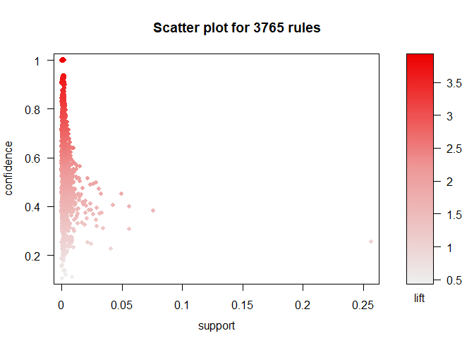<!-- -->

The top ten rules by confidence.

    ##      lhs                     rhs              support confidence    coverage     lift count
    ## [1]  {rice,                                                                                
    ##       sugar}              => {whole milk} 0.001220132          1 0.001220132 3.913649    12
    ## [2]  {canned fish,                                                                         
    ##       hygiene articles}   => {whole milk} 0.001118454          1 0.001118454 3.913649    11
    ## [3]  {butter,                                                                              
    ##       rice,                                                                                
    ##       root vegetables}    => {whole milk} 0.001016777          1 0.001016777 3.913649    10
    ## [4]  {flour,                                                                               
    ##       root vegetables,                                                                     
    ##       whipped/sour cream} => {whole milk} 0.001728521          1 0.001728521 3.913649    17
    ## [5]  {butter,                                                                              
    ##       domestic eggs,                                                                       
    ##       soft cheese}        => {whole milk} 0.001016777          1 0.001016777 3.913649    10
    ## [6]  {butter,                                                                              
    ##       hygiene articles,                                                                    
    ##       pip fruit}          => {whole milk} 0.001016777          1 0.001016777 3.913649    10
    ## [7]  {hygiene articles,                                                                    
    ##       root vegetables,                                                                     
    ##       whipped/sour cream} => {whole milk} 0.001016777          1 0.001016777 3.913649    10
    ## [8]  {hygiene articles,                                                                    
    ##       pip fruit,                                                                           
    ##       root vegetables}    => {whole milk} 0.001016777          1 0.001016777 3.913649    10
    ## [9]  {cream cheese,                                                                        
    ##       domestic eggs,                                                                       
    ##       sugar}              => {whole milk} 0.001118454          1 0.001118454 3.913649    11
    ## [10] {curd,                                                                                
    ##       domestic eggs,                                                                       
    ##       sugar}              => {whole milk} 0.001016777          1 0.001016777 3.913649    10

``` r
subrulesmilk <- head(milk_rules, n = 10, by = "lift")
plot(subrulesmilk, method = "paracoord")
```

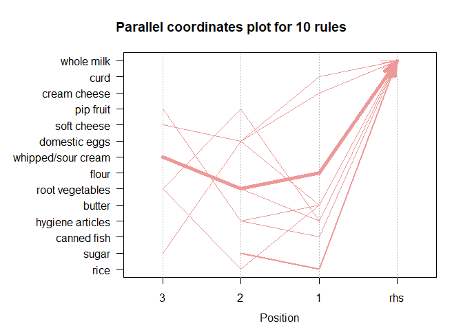<!-- -->

Examining the results for whole milk, baskets show trends of dairy
products being bought together.

## Alcohol Subset

Looking closer at the purchase patterns associated with alcohol
purchases such as red wine, beer and liquor, allows the store to
understand common trends about their premium items. We lower the support
slightly as these are less common items purchased while still keeping
the confidence the same to show strong rules.

``` r
redwine_rules <- apriori(data=groceries, parameter=list (supp=0.0005,conf = 0.08), appearance = list (rhs="red/blush wine"))
```

    ## Apriori
    ## 
    ## Parameter specification:
    ##  confidence minval smax arem  aval originalSupport maxtime support minlen
    ##        0.08    0.1    1 none FALSE            TRUE       5  0.0005      1
    ##  maxlen target  ext
    ##      10  rules TRUE
    ## 
    ## Algorithmic control:
    ##  filter tree heap memopt load sort verbose
    ##     0.1 TRUE TRUE  FALSE TRUE    2    TRUE
    ## 
    ## Absolute minimum support count: 4 
    ## 
    ## set item appearances ...[1 item(s)] done [0.00s].
    ## set transactions ...[169 item(s), 9835 transaction(s)] done [0.01s].
    ## sorting and recoding items ... [164 item(s)] done [0.00s].
    ## creating transaction tree ... done [0.00s].
    ## checking subsets of size 1 2 3 4 5 6 7 done [0.05s].
    ## writing ... [32 rule(s)] done [0.01s].
    ## creating S4 object  ... done [0.00s].

``` r
plot(redwine_rules)
```

    ## To reduce overplotting, jitter is added! Use jitter = 0 to prevent jitter.

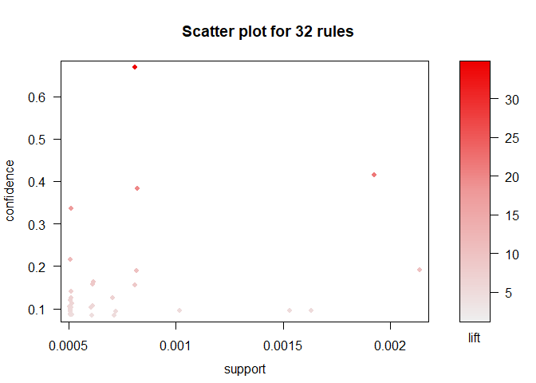<!-- -->

Top ten rules for red wine by confidence.

    ##      lhs                           rhs                   support confidence    coverage      lift count
    ## [1]  {bottled beer,                                                                                    
    ##       liquor,                                                                                          
    ##       soda}                     => {red/blush wine} 0.0008134215  0.6666667 0.001220132 34.691358     8
    ## [2]  {bottled beer,                                                                                    
    ##       liquor}                   => {red/blush wine} 0.0019318760  0.4130435 0.004677173 21.493559    19
    ## [3]  {liquor,                                                                                          
    ##       soda}                     => {red/blush wine} 0.0008134215  0.3809524 0.002135231 19.823633     8
    ## [4]  {bottled beer,                                                                                    
    ##       napkins,                                                                                         
    ##       soda}                     => {red/blush wine} 0.0005083884  0.3333333 0.001525165 17.345679     5
    ## [5]  {ham,                                                                                             
    ##       soda,                                                                                            
    ##       whole milk}               => {red/blush wine} 0.0005083884  0.2173913 0.002338587 11.312399     5
    ## [6]  {liquor}                   => {red/blush wine} 0.0021352313  0.1926606 0.011082867 10.025484    21
    ## [7]  {bottled water,                                                                                   
    ##       long life bakery product} => {red/blush wine} 0.0008134215  0.1904762 0.004270463  9.911817     8
    ## [8]  {fruit/vegetable juice,                                                                           
    ##       shopping bags,                                                                                   
    ##       whole milk}               => {red/blush wine} 0.0006100661  0.1621622 0.003762074  8.438438     6
    ## [9]  {bottled water,                                                                                   
    ##       newspapers,                                                                                      
    ##       rolls/buns}               => {red/blush wine} 0.0006100661  0.1578947 0.003863752  8.216374     6
    ## [10] {bottled beer,                                                                                    
    ##       napkins}                  => {red/blush wine} 0.0008134215  0.1568627 0.005185562  8.162672     8

``` r
subruleswine <- head(redwine_rules, n = 10, by = "confidence")
plot(subruleswine, method = "paracoord")
```

<!-- -->

Liquor rules. Lowered the support slightly as liquor is a less common
purchase than red wine.

``` r
liquor_rules <- apriori(data=groceries, parameter=list (supp=0.0001,conf = 0.08), appearance = list (rhs="liquor"))
```

    ## Apriori
    ## 
    ## Parameter specification:
    ##  confidence minval smax arem  aval originalSupport maxtime support minlen
    ##        0.08    0.1    1 none FALSE            TRUE       5  0.0001      1
    ##  maxlen target  ext
    ##      10  rules TRUE
    ## 
    ## Algorithmic control:
    ##  filter tree heap memopt load sort verbose
    ##     0.1 TRUE TRUE  FALSE TRUE    2    TRUE
    ## 
    ## Absolute minimum support count: 0 
    ## 
    ## set item appearances ...[1 item(s)] done [0.00s].
    ## set transactions ...[169 item(s), 9835 transaction(s)] done [0.01s].
    ## sorting and recoding items ... [169 item(s)] done [0.00s].
    ## creating transaction tree ... done [0.00s].
    ## checking subsets of size 1 2 3 4 5 6 7

    ## Warning in apriori(data = groceries, parameter = list(supp = 0.0001, conf =
    ## 0.08), : Mining stopped (time limit reached). Only patterns up to a length of 7
    ## returned!

    ##  done [8.57s].
    ## writing ... [21618 rule(s)] done [1.83s].
    ## creating S4 object  ... done [0.89s].

``` r
plot(liquor_rules)
```

    ## To reduce overplotting, jitter is added! Use jitter = 0 to prevent jitter.

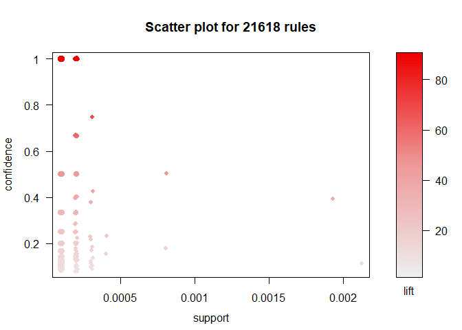<!-- -->

    ##      lhs                                     rhs      support      confidence
    ## [1]  {brandy,dishes}                      => {liquor} 0.0001016777 1         
    ## [2]  {brandy,long life bakery product}    => {liquor} 0.0001016777 1         
    ## [3]  {mayonnaise,nut snack}               => {liquor} 0.0001016777 1         
    ## [4]  {dishes,nut snack}                   => {liquor} 0.0001016777 1         
    ## [5]  {beef,nut snack}                     => {liquor} 0.0001016777 1         
    ## [6]  {liquor (appetizer),rum}             => {liquor} 0.0001016777 1         
    ## [7]  {chocolate marshmallow,rum}          => {liquor} 0.0001016777 1         
    ## [8]  {candy,rum}                          => {liquor} 0.0001016777 1         
    ## [9]  {dish cleaner,liquor (appetizer)}    => {liquor} 0.0001016777 1         
    ## [10] {cling film/bags,liquor (appetizer)} => {liquor} 0.0001016777 1         
    ##      coverage     lift     count
    ## [1]  0.0001016777 90.22936 1    
    ## [2]  0.0001016777 90.22936 1    
    ## [3]  0.0001016777 90.22936 1    
    ## [4]  0.0001016777 90.22936 1    
    ## [5]  0.0001016777 90.22936 1    
    ## [6]  0.0001016777 90.22936 1    
    ## [7]  0.0001016777 90.22936 1    
    ## [8]  0.0001016777 90.22936 1    
    ## [9]  0.0001016777 90.22936 1    
    ## [10] 0.0001016777 90.22936 1

``` r
subrulesliquor <- head(liquor_rules, n = 10, by = "confidence")
plot(subrulesliquor, method = "paracoord")
```

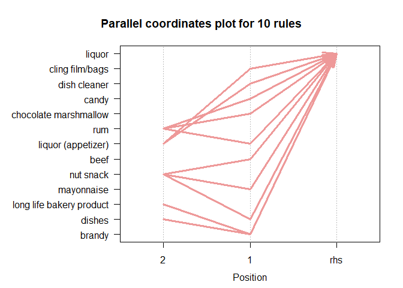<!-- -->

Beer rules.

``` r
beer_rules <- apriori(data=groceries, parameter=list (supp=0.001,conf = 0.08), appearance = list (rhs="bottled beer"))
```

    ## Apriori
    ## 
    ## Parameter specification:
    ##  confidence minval smax arem  aval originalSupport maxtime support minlen
    ##        0.08    0.1    1 none FALSE            TRUE       5   0.001      1
    ##  maxlen target  ext
    ##      10  rules TRUE
    ## 
    ## Algorithmic control:
    ##  filter tree heap memopt load sort verbose
    ##     0.1 TRUE TRUE  FALSE TRUE    2    TRUE
    ## 
    ## Absolute minimum support count: 9 
    ## 
    ## set item appearances ...[1 item(s)] done [0.00s].
    ## set transactions ...[169 item(s), 9835 transaction(s)] done [0.01s].
    ## sorting and recoding items ... [157 item(s)] done [0.00s].
    ## creating transaction tree ... done [0.00s].
    ## checking subsets of size 1 2 3 4 5 6 done [0.03s].
    ## writing ... [313 rule(s)] done [0.00s].
    ## creating S4 object  ... done [0.00s].

``` r
plot(beer_rules)
```

    ## To reduce overplotting, jitter is added! Use jitter = 0 to prevent jitter.

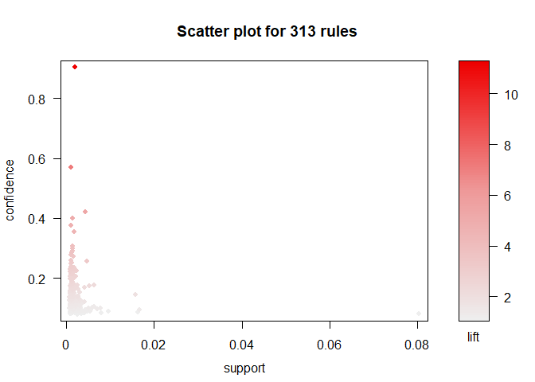<!-- -->

    ##      lhs                   rhs                support confidence    coverage      lift count
    ## [1]  {liquor,                                                                               
    ##       red/blush wine}   => {bottled beer} 0.001931876  0.9047619 0.002135231 11.235269    19
    ## [2]  {liquor,                                                                               
    ##       soda}             => {bottled beer} 0.001220132  0.5714286 0.002135231  7.095960    12
    ## [3]  {liquor}           => {bottled beer} 0.004677173  0.4220183 0.011082867  5.240594    46
    ## [4]  {bottled water,                                                                        
    ##       herbs}            => {bottled beer} 0.001220132  0.4000000 0.003050330  4.967172    12
    ## [5]  {soups,                                                                                
    ##       whole milk}       => {bottled beer} 0.001118454  0.3793103 0.002948653  4.710249    11
    ## [6]  {red/blush wine,                                                                       
    ##       soda}             => {bottled beer} 0.001626843  0.3555556 0.004575496  4.415264    16
    ## [7]  {other vegetables,                                                                     
    ##       red/blush wine}   => {bottled beer} 0.001525165  0.3061224 0.004982206  3.801407    15
    ## [8]  {bottled water,                                                                        
    ##       domestic eggs,                                                                        
    ##       other vegetables} => {bottled beer} 0.001220132  0.3000000 0.004067107  3.725379    12
    ## [9]  {bottled water,                                                                        
    ##       oil}              => {bottled beer} 0.001220132  0.2926829 0.004168785  3.634516    12
    ## [10] {tea}              => {bottled beer} 0.001118454  0.2894737 0.003863752  3.594664    11

``` r
subrulesbeer <- head(beer_rules, n = 10, by = "confidence")
plot(subrulesbeer, method = "paracoord")
```

<!-- -->

### Discussion

Bottled beer, red wine, and liquor all show similar trends and rules.
People tend to purchase alcohol items together and along with these
items purchases that are typical for parties such as dishes, candy, or
cling/film bags.

These insights into consumer purchases can help the grocery store in a
variety of ways such as promotions, coupons or item placement. Items,
such as liquor that they want to sell more they can promote with other
items that are more commonly purchased. They can also place party items,
such as solo cups or soda mixers nearby to these items as they know
people tend to purchase these items together. For the more common items
like whole milk, it would be helpful to tie these into promotions with
less commonly purchased items as they know many people will be coming
into buy milk regardless.
